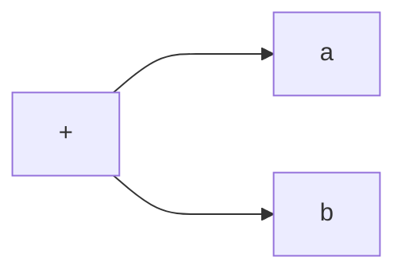
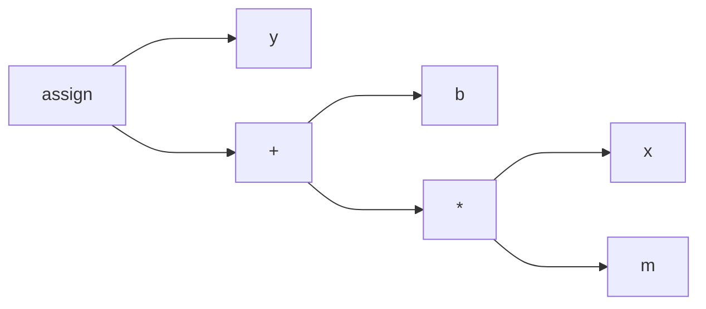

+++
title = 'Java: Compiling and Decompiling'
date = 2024-06-20T15:16:00-04:00
draft = false
UseHugoToc = true
ShowToc = true
TocOpen = true
+++

Java is both a compiled and an interpreted language. The [Java Virtual Machine (JVM)](https://en.wikipedia.org/wiki/Java_virtual_machine) is an intermediary between a high-level language such as Java, Scala, or Kotlin, and the host machine. When a Java program is compiled, it is translated into [Java bytecode](https://en.wikipedia.org/wiki/Java_bytecode) which can then be interpreted by the JVM. Hence the duality.

Why not compile directly to machine code? Well, historically a programmer was either writing machine code by hand, or working with a high-level language like C to interact with the computer hardware. One drawback from this was "vendor lock-in". That is to say: when a program is compiled to machine code, it is not portable to machines with dissimilar machine architecture.

For example, an Apple MacBook Pro (Intel) has a different machine architecture than the Apple MacBook Pro (M1). That means that even though these computers are built by the same company, a program running on one computer cannot run on the other without translating all the machine instructions from x86 to arm64 or vice-versa. It also means that a new compiler would need to be written specific for each computer hardware. This was a major inconvenience in the 1980's and 1990's when the computer hardware ecosystem was very diverse and rapidly evolving. See [x86 Chronology](https://en.wikipedia.org/wiki/X86#Chronology).

The revolutionary idea of Sun Microsystems was to create an intermediate virtual machine with a simple instruction set so that programs were portable across different hardware platforms. Instead of a writing a new compiler for each new computer architecture, a virtual machine could handle the translation from Java bytecode to the machine hardware. Which was a lot simpler than translating a high-level language to a completely different hardware architecture.

## Compiling

If you'd like to get your hand dirty, make sure to [install Java](https://www.java.com/en/download/) before continuing.

To help us understand how Java is compiled into [Java bytecode](https://en.wikipedia.org/wiki/Java_bytecode), we need to learn a few tricks. Lets create a simple Java program performs  ["Hello, world!"](https://en.wikipedia.org/wiki/%22Hello,_World!%22_program).

```java
public class HelloWorldProgram {
    public static void main(String[] args) {
        System.out.println("Hello, world!");
    }
}
```

Save this Java class to a file called `HelloWorldProgram.java`. Now compile the program using the following command.

```shell
javac HelloWorldProgram.java
```

This should create a class file called `HelloWorldProgram.class` in the current working directory.

You can run this program with this command. (Note: we must omit the `.class` in the next snippet).

```shell
java HelloWorldProgram
```

The following is printed to standard out.

```
Hello, world!
```

Congratulations! You can now compile a Java program into bytecode, and run the program. Now, lets take it a bit further and de-compile the code.

## De-compiling

Have you ever been curious about what Java bytecode looks like? In this section, we take a closer look at how Java is compiled. It will help you understand how a class method's are compiled.

Hopefully you have had a chance to compile a class already. I'll assume you already have a compiled class file in the working directory called `HelloWorldProgram.class`.

Use this command to de-compile your program.

```shell
javap -c HelloWorldProgram
```

You should see the following printed out to standard-output.

```
Compiled from "HelloWorldProgram.java"
public class HelloWorldProgram {
  public HelloWorldProgram();
    Code:
       0: aload_0
       1: invokespecial #1                  // Method java/lang/Object."<init>":()V
       4: return

  public static void main(java.lang.String[]);
    Code:
       0: getstatic     #2                  // Field java/lang/System.out:Ljava/io/PrintStream;
       3: ldc           #3                  // String Hello, world!
       5: invokevirtual #4                  // Method java/io/PrintStream.println:(Ljava/lang/String;)V
       8: return
}
```

What we are looking at is not raw bytecode, but a human readable representation. There is one class, and two methods:

1. The constructor: `public HelloWorldProgram();`
2. The main method: `public static void main(java.lang.String[]);`

Within the methods, we can see a `Code:` section. The columns are:
1. **Line numbers** at the far-left,
2. followed by **Instructions**,
3. followed by TODO
4. followed by the **Descriptor**

You will find the line number column is helpful for when you are inspecting branching instructions.

The descriptor is useful for getting a sense of where the instruction originated, but also servers as a landmark when class files are much larger than this example.

To better understand what these instructions are actually doing, you should know a bit about how Java works with values.

## Instruction Set Architecture

Again, let's start with a bit of a history lesson.

Many simple processors are based on a [load-store architecture](https://en.wikipedia.org/wiki/Load%E2%80%93store_architecture) like [MIPS](https://en.wikipedia.org/wiki/MIPS_architecture). That means instructions operate on [processor registers](https://en.wikipedia.org/wiki/Processor_register). So a MIPS arithmetic instruction must specify which register the value is located to perform addition or subtraction.

Alternatively, the Intel x86 instruction set is more flexible on where values are located when performing operations. These instructions allow the programmer to specify both registers or memory, which means it is a [register-memory architecture](https://en.wikipedia.org/wiki/Register%E2%80%93memory_architecture).

Let's take a look at a couple of examples from the Intel x86 instruction set.

> The inc instruction increments the contents of its operand by one.

Increment syntax:
```
inc <reg>
inc <mem>
```

Which implies that the value must first be loaded into the register (or some memory address).

> The mov instruction copies the data item referred to by its second operand (i.e. register contents, memory contents, or a constant value) into the location referred to by its first operand (i.e. a register or memory).

Move syntax:
```
mov <reg>,<reg>
mov <reg>,<mem>
mov <mem>,<reg>
mov <reg>,<const>
mov <mem>,<const>
```

A strategy to perform a value increment operation might be to:
1. move a constant into a register
2. increment the known register

This might mean a program like this:

```c
int i = 10;
i++;
```

Maybe compiled into this assembly code:

```x86
mov ecx,10
inc ecx
```

For these types of processors, the number of registers is fixed. When the machine code is generated, the compiler must be clever enough to be able to keep track of which identifiers (variable names) map to which registers, even when the number of identifiers exceed the number of registers. As you can imagine: as the number of variables increase the more likely instructions must be introduced to shuffle values between registers and the stack.

Sun Microsystems on the other hand, had a unique way of managing values called the [Operand Stack](https://docs.oracle.com/javase/specs/jvms/se12/html/jvms-2.html#jvms-2.6.2), which a compiler can take advantage to avoid inefficient value shuffling.

## The Operand Stack

Instead of shuffling values between registers and memory, the JVM instruction set allows for values to be pushed or popped from a [stack](https://en.wikipedia.org/wiki/Stack_(abstract_data_type)) of memory it manages. When an operation is performed, values are first pushed onto the stack in advance. Typically a JVM arithmetic computation pops values off the stack, computes the result, and pushes the result onto the stack so the next instruction can interact with it.

Program instructions:
1. `iconst_5` (push constant value 5)
2. `iconst_9` (push constant value 9)
3. `iadd`     (pop 2 values, add them, then push result onto stack)

Notice the difference?

Not really, the x86 program this might look like:
1. `mov eax,5`   (move constant value 5 into eax)
2. `mov ebx,9`   (move constant value 9 into ebx)
3. `add eax,ebx` (add eax and ebx and store result in eax)

Well, for small programs, the number of instructions would be similar. However, eventually register based instructions sets will need to be inserted into a binary to just to shuffle data around. Fortunately, with the Operand Stack, complex operations are scalable. To achieve this, a Java bytecode compiler must be careful to manage the order of operations (rather than the registers) to be able to compute the value.

You may recall from a computer science course that the [Depth-first search algorithm](https://en.wikipedia.org/wiki/Depth-first_search) uses a stack to traverse a [tree](https://en.wikipedia.org/wiki/Tree_(data_structure)). Given an expression `a + b`, this can be represented as a tree, where the add-operator (`+`) is a parent node, and the variable `a` and `b` are terms of the expression but also children of the operator. See [Abstract Syntax Tree](https://en.wikipedia.org/wiki/Abstract_syntax_tree).



A Java compiler might perform a depth-first search traversal, which visits the children first, before the parent. The visit order would be:

1. visit a
2. visit b
3. visit +

Which looks just like our Java bytecode from above. When these instructions complete, we know the value at the top of the Operand Stack is the result of `a + b`.

Let's work with a more complicated expression, a linear one.

```
y = m*x + b
```

Mathematical [order of operation](https://en.wikipedia.org/wiki/Order_of_operations) is very important. For example, we must multiply `m` and `x` before adding `b`, otherwise the value of `y` will be wrong.

1. push `m`
1. push `x`
1. multiply
1. push `b`
1. add
1. store into `y`

The AST may look something like this tree:


