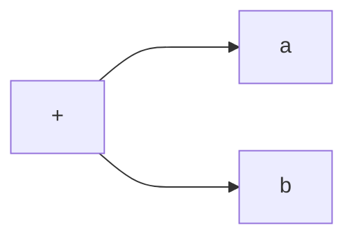
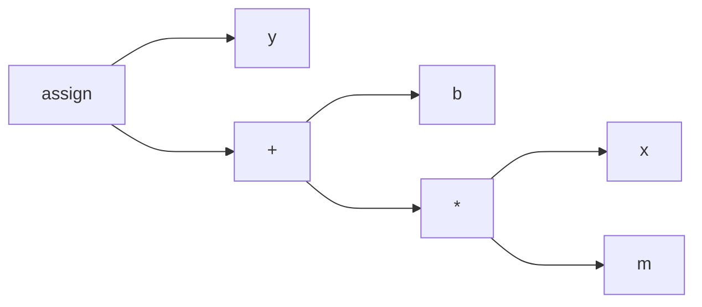

+++
title = 'Java: Compiling and Decompiling'
date = 2024-06-20T15:16:00-04:00
draft = false
tags = ["java", "compilers"]

ShowReadingTime = true
ShowWordCount = true

UseHugoToc = true
ShowToc = true
TocOpen = true

[cover]
image = '/posts/java-compiling-and-decompiling/cover.png'
alt = 'Java comping and decompiling cover image'
caption = ''
relative = false
+++

Java is both a compiled and an interpreted language. The [Java Virtual Machine (JVM)](https://en.wikipedia.org/wiki/Java_virtual_machine) is an intermediary between a high-level language such as Java, Scala, or Kotlin, and the host machine. When a Java program is compiled, it is translated into [Java bytecode](https://en.wikipedia.org/wiki/Java_bytecode) which can then be interpreted by the JVM. Hence the duality.

Why not compile directly to machine code? Well, historically a programmer was either writing machine code by hand, or working with a high-level language like C to interact with the computer hardware. One drawback from this was [vendor lock-in](https://en.wikipedia.org/wiki/Vendor_lock-in). That is to say: when a program is compiled to machine code, it is not portable to machines with dissimilar instruction set architecture (ISA).

For example, an Apple MacBook Pro (Intel) has a different ISA than the Apple MacBook Pro (M1). That means that (even though these computers are built by the same company) a program that can run on one computer cannot run on the other without translating all the machine instructions from x86 to arm64 or vice-versa. It also means that a new compiler would need to be written specifically for each ISA. This was a major inconvenience in the 1980's and 1990's when the computer hardware ecosystem was very diverse and rapidly evolving. See [x86 Chronology](https://en.wikipedia.org/wiki/X86#Chronology).

The revolutionary idea of Sun Microsystems was to create an intermediate virtual machine with a standard instruction set so that programs were portable across different hardware platforms. Instead of a writing a program for each ISA variation, a virtual machine handles the translation from Java bytecode to the machine hardware and provide a platform which a software developer could expect consistency from (garbage collection, type safety, concurrency, etc). Which was a lot more appealing to a software developer than translating a program into different computer hardware. A program could be written in Java, and work on any machine Sun Microsystems had implemented their virtual machine for without compiling again. Once the bytecode is generated, it can run on almost all machines supporting Java.

## Compiling

If you'd like to get your hands dirty, make sure to [install Java](https://www.java.com/en/download/) before continuing.

To help you understand how Java is compiled into [Java bytecode](https://en.wikipedia.org/wiki/Java_bytecode), we need to learn a few tricks. Lets create a simple Java program, that performs an arithmetic operation and prints the result.

```java
public class MathProgram {
    public static void main(String[] args) {
        int m = 3;
        int x = 2;
        int b = 1;
        int y = m*x + b;
        System.out.println("result: " + y);
    }
}
```

Save this Java class to a file called `MathProgram.java`. Compile the program using the following command.

```shell
javac MathProgram.java
```

This should create a class file called `MathProgram.class` in the current working directory. You can now run this program with this command.

Note: we must omit the `.class` for this next snippet, since we are expected to provide a class name not a source file.

```shell
java MathProgram
```

The following is printed to standard out.

```
result: 7
```

Congratulations! You can now compile a Java program into bytecode, and run the program. Now, lets take it a bit further and de-compile the code.

## De-compiling

Have you ever been curious about what Java bytecode looks like? Let's take a closer look at what Java is compiled into.

Hopefully you have had a chance to compile a class already. I'll assume you have a compiled class file in the working directory called `MathProgram.class`.

Use this command to de-compile your program.

```shell
javap -c MathProgram
```

You should see the following printed out to standard-output.

```
Compiled from "MathProgram.java"
public class MathProgram {
  public MathProgram();
    Code:
       0: aload_0
       1: invokespecial #1                  // Method java/lang/Object."<init>":()V
       4: return

  public static void main(java.lang.String[]);
    Code:
       0: iconst_3
       1: istore_1
       2: iconst_2
       3: istore_2
       4: iconst_1
       5: istore_3
       6: iload_1
       7: iload_2
       8: imul
       9: iload_3
      10: iadd
      11: istore        4
      13: getstatic     #2                  // Field java/lang/System.out:Ljava/io/PrintStream;
      16: new           #3                  // class java/lang/StringBuilder
      19: dup
      20: invokespecial #4                  // Method java/lang/StringBuilder."<init>":()V
      23: ldc           #5                  // String result:
      25: invokevirtual #6                  // Method java/lang/StringBuilder.append:(Ljava/lang/String;)Ljava/lang/StringBuilder;
      28: iload         4
      30: invokevirtual #7                  // Method java/lang/StringBuilder.append:(I)Ljava/lang/StringBuilder;
      33: invokevirtual #8                  // Method java/lang/StringBuilder.toString:()Ljava/lang/String;
      36: invokevirtual #9                  // Method java/io/PrintStream.println:(Ljava/lang/String;)V
      39: return
}
```

What we are looking at is not raw bytecode, but a human readable representation. There is one class, and two methods:

1. The constructor: `public MathProgram();`
2. The main method: `public static void main(java.lang.String[]);`

Within the methods, we can see a `Code:` section. The columns are:
1. **Line numbers** at the far-left,
2. followed by **Instructions**,
3. followed by TODO
4. followed by **Descriptor**

You will find the line number column is helpful for when you are inspecting branching instructions. Where as the descriptor can give you a sense where the method instruction originated. Use it as a landmark when class files are much larger than this example.

To better understand what these instructions are actually doing, you should know a bit about how computers work.

## Instruction Set Architecture

A computer has input, output, memory, and performs an task. Sophisticated computers have the ability to be programmed. No, I am not referring to setting a time on a microwave. A programmable computer has been designed to run code compatible with the [instruction set architecture](https://en.wikipedia.org/wiki/Instruction_set_architecture) to control a processor.

Many simple processors are based on a [load-store architecture](https://en.wikipedia.org/wiki/Load%E2%80%93store_architecture) like [MIPS](https://en.wikipedia.org/wiki/MIPS_architecture). That means instructions operate on [processor registers](https://en.wikipedia.org/wiki/Processor_register). Typically values are moved into registers and instructions operate on these registers. So a MIPS arithmetic instruction must specify which register the value is located to perform addition, subtraction, etc.

Another popular ISA is the Intel x86 instruction set. It is more flexible on where values are located when performing operations. These instructions allow the programmer to specify both registers or memory, which means it is a [register-memory architecture](https://en.wikipedia.org/wiki/Register%E2%80%93memory_architecture).

Let's take a look at a couple of examples from the Intel x86 instruction set.

> The inc instruction increments the contents of its operand by one.

Increment syntax:
```
inc <reg>
inc <mem>
```

Which implies that the value must first be loaded into the register (or some memory address).

> The mov instruction copies the data item referred to by its second operand (i.e. register contents, memory contents, or a constant value) into the location referred to by its first operand (i.e. a register or memory).

Move syntax:
```
mov <reg>,<reg>
mov <reg>,<mem>
mov <mem>,<reg>
mov <reg>,<const>
mov <mem>,<const>
```

A strategy to perform a value increment operation might be to:
1. move a constant into a register
2. increment the known register

A program like this:

```c
int i = 10;
i++;
```

...could compile into this assembly code:

```x86
mov ecx,10
inc ecx
```

For these types of processors, the number of registers is fixed. When the machine code is generated, the compiler must be clever enough to be able to keep track of which identifiers map to which registers. Even when the number of identifiers exceed the number of registers, the compiler should still be able to perform the task. As you can imagine: as the number of variables increase the more likely instructions must be introduced to shuffle values between registers and the stack.

Sun Microsystems on the other hand, had a unique way of managing values called the [Operand Stack](https://docs.oracle.com/javase/specs/jvms/se12/html/jvms-2.html#jvms-2.6.2), which a compiler can take advantage to avoid inefficient value shuffling.

## The Operand Stack

Instead of shuffling values between registers and memory, the JVM instruction set allows for values to be pushed or popped from a [stack](https://en.wikipedia.org/wiki/Stack_(abstract_data_type)) of memory it manages. When an operation is performed, values are first pushed onto the stack in advance. Generally a JVM arithmetic computation pops values off the stack, computes the result, and pushes the result onto the stack so the next instruction can interact with it.

Bytecode instructions:
1. `iconst_5` -- "push constant value 5"
2. `iconst_9` -- "push constant value 9"
3. `iadd` -- "pop 2 values, add them, then push result onto stack"

x86 instructions:
1. `mov eax,5` -- "move constant value 5 into register eax"
2. `mov ebx,9` -- "move constant value 9 into register ebx"
3. `add eax,ebx` -- "add eax and ebx and store result in eax"

Notice the difference? No, not really.

For small programs, the number of instructions are going to be similar. However, eventually there won't be any registers left, and it will be necessary to shuffle values using additional instructions. This is known as "register spilling" and this is component to an [NP-complete problem](https://en.wikipedia.org/wiki/NP-completeness) of [register allocation](https://en.wikipedia.org/wiki/Register_allocation). Fortunately, with the Operand Stack, complex operations are scalable. To achieve this, a Java bytecode compiler must decide on how to push and swap values on the stack (a sized that is varies) at compile-time. Where as register based ISA's are limited by the physical number of processor registers.

Thought: if an NP-complete problem is reducible to a solution that uses the Operand Stack, what does that say about NP-complete? Does P = NP = NP-complete?

You may recall from a computer science course that the [Depth-first search algorithm](https://en.wikipedia.org/wiki/Depth-first_search) uses a stack to traverse a [tree](https://en.wikipedia.org/wiki/Tree_(data_structure)) or [graph](https://en.wikipedia.org/wiki/Graph_(abstract_data_type)). Given an expression `a + b`, this can be represented as an [Abstract Syntax Tree](https://en.wikipedia.org/wiki/Abstract_syntax_tree), where the addition (+) operator is a parent node, and the variables `a` and `b` are children of the operator.



A Java compiler implementation may perform a depth-first search traversal. Each child is visited before the parent with this order:

1. visit `a` -- "push a"
2. visit `b` -- "push b"
3. visit `+` -- "pop a and b, add them, then push result onto stack"

Which looks just like our Java bytecode from above. When these instructions execute, we know the value at the top of the Operand Stack is the result of `a + b`.

Let's work with a more complicated expression, a linear one.

```
y = m*x + b
```

To compile this expression, arithmetic [order of operation](https://en.wikipedia.org/wiki/Order_of_operations) must be considered. For example, we must multiply `m` and `x` before adding `b`, otherwise the value of `y` will be wrong. Keeping in mind that the AST traversed using DFS, will visit the farthest children from  the root first, then we should ensure that the multiplication is far from the assignment. That was we assign `y` the result last, and start with multiplying `m*x`.

1. m*x
2. (m*x) + b
3. y = ((m*x) + b)

Here is an AST that can be used to compile the expression.



To get an idea of how this program would execute, let m = 3, x = 2, b = 1.

| Line No. | Instruction | Operand Stack |
|----------|-------------|---------------|
| 0        | push m      | `-> 3`        |
| 1        | push x      | `-> 2 -> 3`   |
| 2        | multiply    | `-> 6`        |
| 3        | push b      | `-> 1 -> 6`   |
| 4        | add         | `-> 7`        |
| 5        | store y     | `-> `         |

Now returning to our de-compiled class `MathProgram.class`, we can see that this is how it really was compiled.

| Line No. | Instruction | Operand Stack | Description                          |
|----------|-------------|---------------|--------------------------------------|
| 0        | iconst_3    | `-> 3`        | "push 3"                             |
| 1        | istore_1    | `->`          | "m = 3: pop value into variable 1"   |
| 2        | iconst_2    | `-> 2`        | "push 2"                             |
| 3        | istore_2    | `->`          | "x = 2: pop value into variable 2"   |
| 4        | iconst_1    | `-> 1`        | "push 1"                             |
| 5        | istore_3    | `->`          | "b = 1: pop value into variable 3"   |
| 6        | iload_1     | `-> 3`        | "push m"                             |
| 7        | iload_2     | `-> 2 -> 3`   | "push x"                             |
| 8        | imul        | `-> 6`        | "multiply m by x                     |
| 9        | iload_3     | `-> 1 -> 6`   | "push b"                             |
| 10       | iadd        | `->  7`       | "add"                                |
