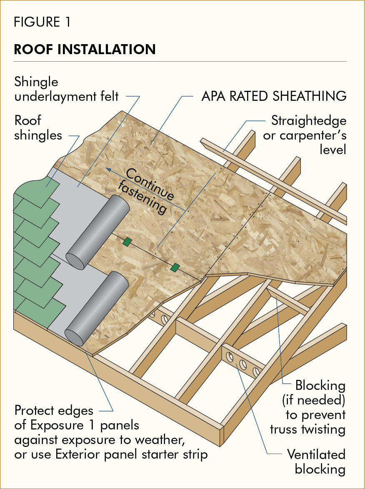

+++
title = 'Shed Build 2024'
date = 2024-07-29T07:46:24-04:00
draft = false

ShowReadingTime = true
ShowWordCount = true

UseHugoToc = true
ShowToc = true
TocOpen = true

[cover]
image = '/posts/shed/alex-shed.jpg'
alt = 'Alex and shed'
caption = 'July 28, 2024: Alex posing in front of his new shed'
relative = false
+++

My friend Alex is moving out of Waterloo. He bought a house, but had already started building a shed this summer with a concrete pour. We talked about moving his gazebo and bbq onto the new concrete pad, but it made more sense to build a shed.

- Great selling feature for a potential buyer
- Storage to unclutter his house for staging
- No confusing the purpose of the concrete pad
- The new house already has a good shed

He called me up and asked for some help so I jumped at the opportunity to learn new skills. Alex told me his dad was able to get a lot of the project done with him already. It didn't have a roof yet, doors, or a window. What they had was the base plate, walls and some painting done.

I loaded up my car with tools: circular saw, jigsaw, drill driver, hammer and measuring tape. When I got there the first thing we worked on was the roof.



Up on a ladder we lined up sheathing with the rafters, and screwed the boards down. Everything was going well except one corner, which wasn't square. It can be tricky to find out where the shape was lost, so you have to play detective.

1. Check the square of the base plate
1. Check the square of the top plate
1. Check the level of the studs using a [Bubble Level](https://en.wikipedia.org/wiki/Spirit_level)

## How-to: Check for a square

The square of a building can be tested by measuring and comparing diagonal distance from 2 corners of a square. They should equal, otherwise the building is not square.


### Explanation

Recall [Pythagorean Theorem](https://en.wikipedia.org/wiki/Pythagorean_theorem) from math class?

```
a^2 = b^2 + c^2
```

If sides `b` and `c` are perpendicular (make a right-angle), then `a` is the [hypotenuse](https://en.wikipedia.org/wiki/Hypotenuse) (diagonal) of a right-angle triangle. By dividing a square into 2 triangles, the hypotenuse of both triangles should be equal for square and rectangular buildings.

## Squaring the building

It doesn't take much to lose its shape. Building materials, measurement, cutting and placement all accumulate errors during a project. Our roof was off by roughly an inch, which isn't too bad. This was apparent because the rectangular sheathing overhung at the side of the building. Make sure you try your best to square the building before screwing down sheathing and check if its plumb as you make progress.

Some of the screws had to be backed-off. We forced the square of the rafters and walls as close as we could with the sheathing, then secured the boards. There was a little access (about a quarter of an inch) which got trimmed with a circular saw. Then we started rolling out underlayment felt and began nailing shingles.

## Tips for Installing Shingles

Mistakes were made during roof installation, here are my recommendations.

### Use a reference to help guide shingle placement

Shingle placement can drift overtime, resulting in uneven patterns. As shingles are placed row up, each row should be parallel.

If the underlayment has a grid, align it with the roof. Otherwise, mark the roof with [Chalk line](https://en.wikipedia.org/wiki/Chalk_line) for each shingle row considering the overlap.

### Centre align shingles between roof hips

Before stapling / fastening your first row, determine the number of shingles are needed for the row by dividing the width of the roof by the width of the single. Most likely it will not divide evenly. Determine the offset from the hip by calculating the remainder, and dividing in half. This will ensure an even and consistent look of your roof.
